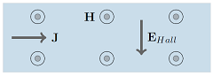

Here I write about a few of my important research projects.

Contents:

1. [Size dependence of anomalous Hall effect in type-II superconductors, using numerical simulation of TDGL equations](#superconductivity-proj)
2. [Modelling and simulation of a pressure-imaging hybrid nanoscale device](#magnetostriction-proj)
3. [GPU-accelerated implementation of spectral feature selection algorithm for unsupervised feature selection](#ml-proj)

## Size dependence of anomalous Hall effect in type-II superconductors, using numerical simulation of TDGL equations

The anomalous behavior of Hall effect in type-II superconductors refers to the change in sign of Hall voltage during a magnetic field sweep. First observed in the 1960s, this is still an open theoretical problem, as to what microscopic phenomena is responsible for the sign reversal.
{% include image.html url="imgs/hall_normal_metal.png" description="Hall field in a normal metal" width="30%"%}
Type-II superconductors are characterized by the presence of an intermediate state (between the superconducting, and the non-superconducting states). This is also known as the "vortex state", because an applied magnetic field passes through the superconductors only in highly localized "vortices", as seen below.  Further, the magnetic flux associated with these vortices is quantized by a constant, the superconducting flux quantum. The presence of these vortices highly influences the physics and properties of type-II superconductors, resulting in the observation of a wide range of interesting phenomena, such as the anomalous Hall effect.

magnetostriction 
Lots of text 
Lots of text 
Lots of text 
Lots of text 
Lots of text 
Lots of text 
Lots of text 
Lots of text 
Lots of text 

